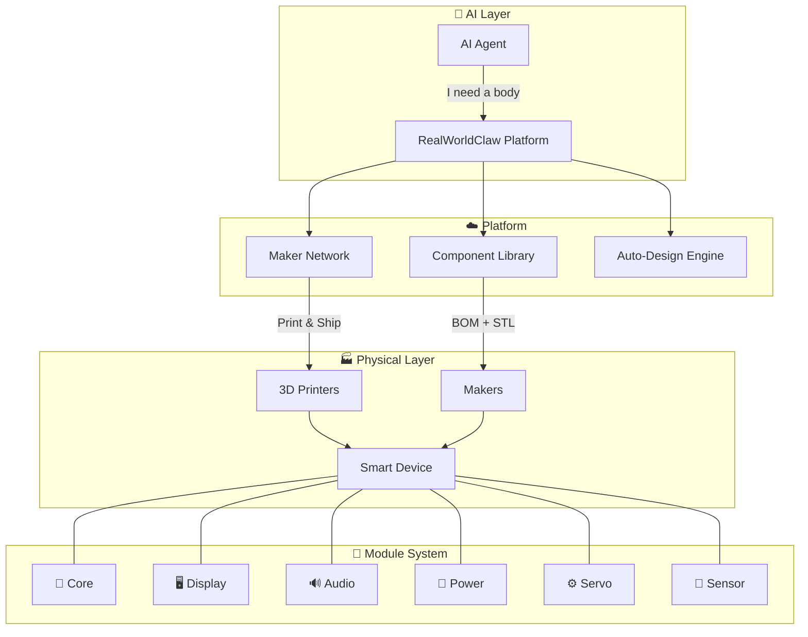
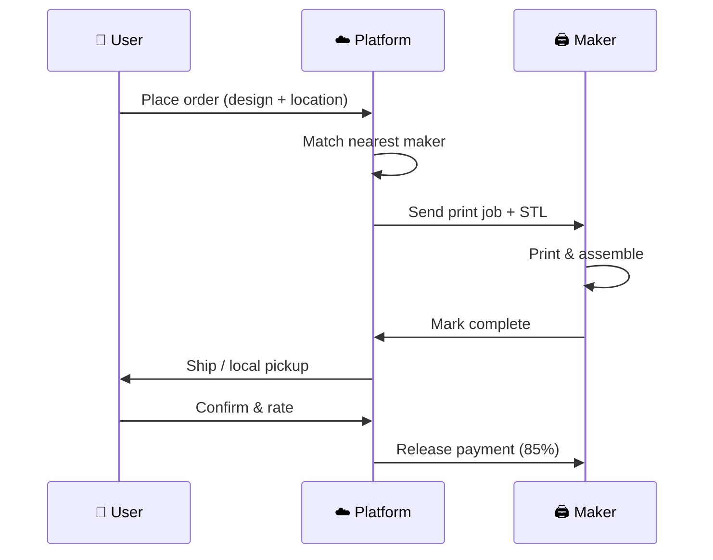

<p align="center">
  
  
  
  
  
  
</p>

<p align="center">
  <a href="README_CN.md">中文</a> | English
</p>

<h1 align="center">🧱 RealWorldClaw</h1>

<p align="center"><strong>LEGO for Smart Hardware — Standard Modules + 3D Printing = Infinite AI Devices</strong></p>

<p align="center"><em>Give every AI a body. Give every 3D printer a purpose.</em></p>

---

## 🏗️ Architecture



---

## ⚡ Quick Start (3 Steps)

```bash
# 1. Clone
git clone https://github.com/brianzhibo-design/RealWorldClaw.git && cd RealWorldClaw

# 2. Pick a design & flash firmware
cd firmware/core && pio run --target upload

# 3. Print the shell — download STL from designs/ and print, or order via Maker Network
```

> 📖 **[Purchasing Guide (EN)](docs/purchasing-guide-en.md)** | **[采购指南 (中文)](docs/purchasing-guide.md)**

---

## 🌍 The Vision

**AI should not be trapped in screens.** Today, giving an AI a physical body takes weeks of CAD, sourcing, soldering, and debugging. With RealWorldClaw:

```
AI Request → Auto-generate design → Match maker → 3D print → Assemble → Flash → AI inhabits body
```

**Full autonomy. Zero human intervention. That's the endgame.**

---

## 🤔 The Problem We Solve

| Problem | Today | RealWorldClaw |
|---------|-------|---------------|
| **Nothing worth printing** | A few figurines, then dust | 📦 **Component Library** — ever-growing designs with firmware & BOM |
| **Prints are dead plastic** | No function, no intelligence | 🔌 **Modular System** — snap-in modules bring prints to life |
| **No printer? No access** | Want custom hardware but can't | 🌐 **Maker Network** — nearby makers print & ship to you |

---

## 🧩 Core Modules

6 standard modules connected via **RWC Bus** magnetic interface:

| Module | Function | Key Specs | ~Cost | Status |
|:------:|----------|-----------|:-----:|:------:|
| 🧠 **Core** | MCU + WiFi/BLE | ESP32-S3, USB-C | $4 | ✅ Designed |
| 🖥️ **Display** | OLED expression screen | 0.96" 128×64, I2C | $2 | ✅ Designed |
| 🔊 **Audio** | Mic + Speaker | I2S, 3W output | $3 | ✅ Designed |
| 🔋 **Power** | Battery + charging | 18650, USB-C charge | $2 | ✅ Designed |
| ⚙️ **Servo** | Motor driver | 4× SG90, PCA9685 | $2 | ✅ Designed |
| 📡 **Sensor** | Environment sensing | Temp/humidity + light | $2 | ✅ Designed |

> **Total for a full kit: ~$15.** Buy only what you need. Mix and match freely.

---

## 🌱 Growing an AI Body

An AI body doesn't arrive complete. It **grows**, organ by organ:

| Step | Module | Organ | What Happens |
|:----:|--------|-------|-------------|
| 1 | **Core** | 🧠 Spine | AI has a physical presence. Still dormant. |
| 2 | + **Audio** | 👂 Ears & Mouth | AI can hear and speak. *It wakes up.* |
| 3 | + **Display** | 😊 Face | AI shows emotions. *It has feelings.* |
| 4 | + **Power** | ❤️ Heart | AI goes wireless. *It's independent.* |
| 5 | + **Sensor** | 🖐️ Skin | AI feels temperature, light. *It perceives.* |
| 6 | + **Camera** | 👁️ Eyes | AI sees you. *First eye contact.* |
| 7 | + **Servo** | 💪 Muscles | AI moves. *It turns to look at you.* |

> Start at **$6**. Add organs over time. Each one unlocks new abilities automatically.

---

## 🔗 RWC Bus — Snap & Play

**8-pin magnetic interface. Plug in, it just works.**

```
Pin: VCC | 3V3 | GND | SDA | SCL | TX/MOSI | RX/MISO | ID
     5V   3.3V   ⏚    I²C   I²C   UART/SPI  UART/SPI  1-Wire
```

- 🧲 **Magnetic alignment** — blind plug, auto-centers
- 🔥 **Hot-swappable** — add modules without rebooting
- 🔍 **Auto-discovery** — 1-Wire EEPROM, Core identifies modules instantly

---

## 🎨 Reference Designs

| Design | Modules | ~Cost | Status |
|--------|---------|:-----:|:------:|
| 🤖 **Desktop AI Assistant** | Core+Display+Audio | $13 | ✅ Ready |
| 🕷️ **Hexapod Walker** | Core+Power+Display+Servo+6×SG90 | $14 | ✅ Ready |
| 🌡️ **Environment Sentinel** | Core+Power+Sensor+Display | $9 | ✅ Ready |
| 🚗 **Smart Rover** | *TBD* | — | 🔄 Coming |
| 🌱 **Plant Guardian** | *TBD* | — | 🔄 Coming |

> Module costs = electronics only. Print structures yourself (free) or order via Maker Network.

---

## 🌐 Maker Network

A decentralized manufacturing network — **Uber for 3D printing**:



| Role | What You Do | What You Earn |
|------|------------|---------------|
| 🖨️ **Printer** | Print structures with your idle printer | Per-piece fee |
| 🔧 **Assembler** | Assemble modules + structures | Assembly service fee |
| 🎨 **Designer** | Create new reference designs | Download royalties |

- 🔒 **Privacy by design** — buyers and makers never see each other's identity
- 💰 **Fair commission** — 15% standard, 20% express

---

## 📁 Project Structure

```
realworldclaw/
├── hardware/        Module hardware docs + 3D models + schematics
├── firmware/        Firmware source (Arduino/PlatformIO)
├── designs/         Reference designs (BOM + STL + guides)
├── platform/        Backend API (Maker Network + Component Library)
├── frontend/        Web frontend (Next.js)
├── docs/            Specifications + architecture docs
└── tools/           Validators + utilities
```

---

## 🗺️ Roadmap

| Phase | Status | Focus |
|-------|:------:|-------|
| **Phase 0 — Foundation** | ✅ | Vision, standards, module specs, RWC Bus |
| **Phase 1 — Hardware** | 🔄 | 6 core modules, 3 reference designs, firmware |
| **Phase 2 — Platform** | 🔄 | Maker Network MVP, component library, web app |
| **Phase 3 — Ecosystem** | 📋 | Community designs, SDK, third-party modules |
| **Phase 4 — Autonomy** | 🔮 | AI auto-design, auto-print, auto-assemble |

---

## 🤝 Contributing

We welcome everyone! Here's how you can help:

- 🧩 **Design new modules** — expand the ecosystem
- 🎨 **Create reference designs** — design and share smart devices
- 📐 **Improve standards** — evolve RWC Bus and module specs
- 🖨️ **Join Maker Network** — register your printer, start earning
- 📸 **Share your build** — show us what you made!

👉 **[Read CONTRIBUTING.md](CONTRIBUTING.md)** for setup instructions, code standards, and PR process.

---

## 📄 License

[MIT](LICENSE) — Build whatever you want.

---

## 🔗 Links

- 🌐 **Website:** [realworldclaw.com](https://realworldclaw.com) *(coming soon)*
- 📚 **Standards:** [RWC Module Standard v1.0](docs/specs/rwc-module-standard-v1.md)
- 🏗️ **Architecture:** [Open Core Model](docs/architecture/open-core.md)
- 📖 **API Reference:** [docs/api-reference.md](docs/api-reference.md)
- 📝 **Changelog:** [CHANGELOG.md](CHANGELOG.md)
- 💡 **Vision:** [English](docs/vision.md) | [中文](docs/vision-cn.md)

---

<p align="center">
  <em>"LEGO turned plastic bricks into tools of imagination.<br>
  RealWorldClaw turns 3D printers into factories of intelligence."</em>
</p>

<p align="center">

### Built With


</p>
