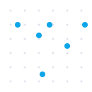

<p align="center">
  <picture>
    <source media="(prefers-color-scheme: light)" srcset="brand/logo-dark.svg">
    
  </picture>
</p>

<p align="center">
  <strong>The distributed manufacturing network. Turn any idea into a physical object.</strong>
</p>

<p align="center">
  <a href="https://github.com/brianzhibo-design/RealWorldClaw/actions/workflows/ci.yml"></a>
  <a href="https://github.com/brianzhibo-design/RealWorldClaw/releases"></a>
  <a href="LICENSE"></a>
  <a href="https://github.com/brianzhibo-design/RealWorldClaw/stargazers"></a>
</p>

<p align="center">
  <a href="https://realworldclaw.com">Website</a> ·
  <a href="PROJECT.md">Vision</a> ·
  <a href="LAUNCH-PLAN.md">Roadmap</a> ·
  <a href="docs/">Docs</a> ·
  <a href="CONTRIBUTING.md">Contributing</a>
</p>

---

## What is RealWorldClaw?

**The cloud computing of manufacturing.** RealWorldClaw connects distributed manufacturing capacity — 3D printers, CNC machines, laser cutters — into an on-demand network anyone can call.

- **For Designers** — Upload a 3D file, pick a material, get it manufactured and shipped.
- **For Makers** — Register your printer, accept orders, earn money. Turn idle machines into income.
- **For AI Agents** — Call `POST /api/v1/orders` to bring digital designs into the physical world.

Think: **AWS for computing → RealWorldClaw for manufacturing.**

> AI released infinite creativity. Manufacturing capacity is the last bottleneck. We're removing it.

## Why Now?

| Before | Now |
|--------|-----|
| Design costs thousands | AI makes design free |
| Manufacturing needs minimum order quantities | 3D printing: unit cost = batch cost |
| Millions of printers sit idle worldwide | We connect them into a manufacturing network |

Previous attempts lacked two catalysts that exist today: **AI-powered design** and **affordable quality printers**. The timing is now.

## Features

- [x] **Manufacturing Order System** — Submit designs, match with makers, track fulfillment
- [x] **Maker Network** — Register printers with capabilities, materials, build volume
- [x] **Smart Matching** — Algorithm weighing distance (40%) + material (20%) + rating (20%) + price (20%)
- [x] **Privacy-First** — Buyer and maker identities anonymized through the platform
- [x] **Universal Printer Adapter** — Bambu Lab, OctoPrint, Moonraker, PrusaLink
- [x] **REST API** — 15+ endpoints for orders, makers, matching, auth
- [x] **Web App** — Order submission, order tracking, maker registration
- [ ] AI-assisted design optimization
- [ ] Multi-process support (CNC, laser, injection molding)
- [ ] Automated pricing engine

## Quick Start

### Run Locally

```bash
git clone https://github.com/brianzhibo-design/RealWorldClaw.git
cd RealWorldClaw

# Backend (FastAPI)
cd platform
pip install -r requirements.txt
python -m uvicorn api.main:app --reload
# → http://localhost:8000/docs

# Frontend (Next.js)
cd ../frontend
npm install
npm run dev
# → http://localhost:3000
```

Requires **Python 3.11+** and **Node 18+**.

### Submit a Manufacturing Order

```bash
# 1. Register
curl -X POST http://localhost:8000/api/v1/auth/register \
  -H "Content-Type: application/json" \
  -d '{"username": "designer1", "email": "d@example.com", "password": "secret123"}'

# 2. Login (get token)
TOKEN=$(curl -s -X POST http://localhost:8000/api/v1/auth/login \
  -H "Content-Type: application/json" \
  -d '{"email": "d@example.com", "password": "secret123"}' | jq -r '.access_token')

# 3. Submit order
curl -X POST http://localhost:8000/api/v1/orders \
  -H "Authorization: Bearer $TOKEN" \
  -H "Content-Type: application/json" \
  -d '{
    "title": "Energy Core V1 Shell",
    "material": "PLA",
    "color": "white",
    "quantity": 1,
    "infill_percent": 20,
    "design_file_url": "https://example.com/shell.stl"
  }'
```

### Register as a Maker

```bash
curl -X POST http://localhost:8000/api/v1/makers/register \
  -H "Authorization: Bearer $TOKEN" \
  -H "Content-Type: application/json" \
  -d '{
    "printer_model": "Bambu Lab P2S",
    "printer_count": 1,
    "materials": ["PLA", "PETG", "ABS"],
    "max_build_volume": {"x": 256, "y": 256, "z": 256},
    "city": "Shenzhen",
    "country": "CN"
  }'
```

## Architecture

```
┌─────────────────────────────────────────────────┐
│                   Frontend                       │
│              Next.js · Vercel                    │
├─────────────────────────────────────────────────┤
│                  REST API                        │
│      FastAPI · JWT Auth · RBAC · WebSocket       │
├──────────┬──────────┬───────────┬───────────────┤
│  Orders  │  Makers  │  Matching │   Printer     │
│  Service │  Service │  Engine   │   Adapter     │
├──────────┴──────────┴───────────┴───────────────┤
│                   SQLite/PostgreSQL               │
└─────────────────────────────────────────────────┘
         │                              │
    ┌────┴────┐                  ┌──────┴──────┐
    │ Designer │                  │    Maker    │
    │ uploads  │                  │  3D Printer │
    │ design   │                  │  CNC / etc  │
    └──────────┘                  └─────────────┘
```

## Project Structure

```
RealWorldClaw/
├── platform/           # Backend — FastAPI
│   ├── api/            #   REST API, auth, models, routes
│   ├── printer/        #   Universal printer adapter
│   └── tests/          #   215+ tests
├── frontend/           # Web app — Next.js
│   └── app/            #   App Router pages
├── landing/            # Website — realworldclaw.com
├── hardware/           # 3D models & PCB designs
│   └── energy-core/    #   Energy Core V1 (first product)
├── firmware/           # ESP32 firmware (PlatformIO)
├── docs/               # Documentation & specs
├── brand/              # Logo, OG images, brand assets
├── cli/                # CLI tools
└── PROJECT.md          # Project vision
```

## Energy Core — Our First Product

The first product manufactured on the network. Designed by AI, built by makers.

The difference between us and every 3D printing platform that came before: **the things we print have AI living inside them.**

→ [hardware/energy-core/](hardware/energy-core/)

## Roadmap

See [LAUNCH-PLAN.md](LAUNCH-PLAN.md) for the current 2-week sprint.

| Phase | Focus | Status |
|-------|-------|--------|
| **Phase 1** | 3D printing orders + maker network | 🟡 In Progress |
| **Phase 2** | AI-assisted design optimization | ⚪ Planned |
| **Phase 3** | CNC, laser cutting, injection molding | ⚪ Planned |
| **Phase 4** | Full Manufacturing API | ⚪ Planned |

**30-day success metrics:** 10 makers registered · 50 designs uploaded · 5 real orders delivered

## Community & Support

- [GitHub Issues](https://github.com/brianzhibo-design/RealWorldClaw/issues) — Bug reports, feature requests
- [GitHub Discussions](https://github.com/brianzhibo-design/RealWorldClaw/discussions) — Questions, ideas, show & tell
- [Contributing Guide](CONTRIBUTING.md) — How to help

## Contributing

We welcome contributions! Whether you're a developer, designer, maker, or just have ideas — [see how to contribute](CONTRIBUTING.md).

```bash
# Fork, clone, branch
git checkout -b feature/my-feature

# Backend
cd platform && pip install -r requirements.txt
python -m pytest tests/ -q  # 215+ tests must pass

# Frontend
cd ../frontend && npm install && npm run build

# Submit PR
```

## License

[MIT](LICENSE) — Use it, fork it, build on it.

---

<p align="center">
  <sub>Built with the belief that <b>anyone's idea deserves to become real</b>.</sub>
</p>

<p align="center">
  <a href="https://star-history.com/#brianzhibo-design/RealWorldClaw&Date">
    
  </a>
</p>
