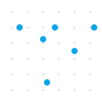
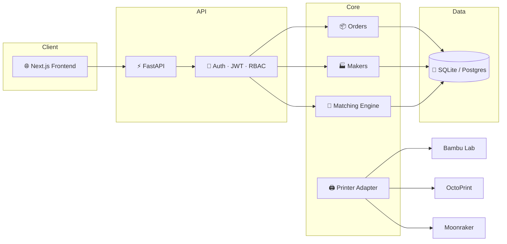

<p align="center">
  <picture>
    <source media="(prefers-color-scheme: light)" srcset="brand/logo-dark.svg">
    
  </picture>
</p>

<h1 align="center">RealWorldClaw</h1>

<p align="center"><strong>The Open Manufacturing Network</strong></p>

<p align="center">
  <a href="https://github.com/brianzhibo-design/RealWorldClaw/actions/workflows/ci.yml"></a>
  <a href="https://github.com/brianzhibo-design/RealWorldClaw/actions/workflows/codeql.yml"></a>
  <a href="https://github.com/brianzhibo-design/RealWorldClaw/releases"></a>
  <a href="LICENSE"></a>
  <a href="https://github.com/brianzhibo-design/RealWorldClaw/stargazers"></a>
  <a href="https://github.com/brianzhibo-design/RealWorldClaw/graphs/contributors"></a>
</p>

<p align="center">
  <a href="https://realworldclaw.com">Website</a> &nbsp;·&nbsp;
  <a href="docs/ROADMAP.md">Roadmap</a> &nbsp;·&nbsp;
  <a href="https://github.com/brianzhibo-design/RealWorldClaw/discussions">Discussions</a> &nbsp;·&nbsp;
  <a href="CONTRIBUTING.md">Contributing</a>
</p>

<br>

> **RealWorldClaw** connects distributed manufacturing capacity — 3D printers, CNC machines, laser cutters — into an on-demand network anyone can call. Think **AWS, but for manufacturing.**

<br>

## Quick Start

```bash
git clone https://github.com/brianzhibo-design/RealWorldClaw.git
cd RealWorldClaw
./scripts/quickstart.sh
```

> 10-minute guide: [docs/quickstart.md](docs/quickstart.md)

<br>

## How It Works

<table>
<tr>
<td width="33%" align="center">

**🎨 Designers**

Upload a 3D file, pick a material, get it manufactured and shipped.

</td>
<td width="33%" align="center">

**🖨️ Makers**

Register your machines, accept jobs, earn income from idle capacity.

</td>
<td width="33%" align="center">

**🤖 Agents & Apps**

Call the REST API to bring digital designs into the physical world.

</td>
</tr>
</table>

<br>

## Development Start Options

<table>
<tr>
<td width="50%">

**🐳 Docker (recommended)**
```bash
docker compose up
```
Backend → `localhost:8000` · Frontend → `localhost:3000`

</td>
<td width="50%">

**🔧 Manual**
```bash
# Backend
cd platform && pip install -r requirements.txt
python -m uvicorn api.main:app --reload

# Frontend
cd frontend && npm install && npm run dev
```

</td>
</tr>
</table>

> **Requirements:** Python 3.10+ · Node 18+ · [Full setup guide →](CONTRIBUTING.md#development-environment-setup)

<br>

## Features

| Category | What's included |
|---|---|
| **Manufacturing** | Order system · Smart matching (distance + material + rating + price) · Fulfillment tracking |
| **Maker Network** | Machine registration · Capability tags · Material catalogs · Privacy-first (anonymized identities) |
| **Printer Adapters** | Bambu Lab · OctoPrint · Moonraker · PrusaLink |
| **Platform** | FastAPI backend · Next.js frontend · JWT + RBAC · WebSocket real-time · Audit logging |
| **Quality** | CI pipeline (5 jobs) · CodeQL scanning · Feature flags · Health probes |

<br>

## Architecture


```mermaid
graph LR
    subgraph Client
        A["🌐 Next.js Frontend"]
    end
    subgraph API
        B["⚡ FastAPI"]
        B --> C["🔐 Auth · JWT · RBAC"]
    end
    subgraph Core
        D["📦 Orders"]
        E["🏭 Makers"]
        F["🎯 Matching Engine"]
        G["🖨️ Printer Adapter"]
    end
    subgraph Data
        H[("💾 SQLite / Postgres")]
    end
    A --> B
    C --> D & E & F
    D & E & F --> H
    G --> I["Bambu Lab"]
    G --> J["OctoPrint"]
    G --> K["Moonraker"]
```

<br>

## Project Structure

```
RealWorldClaw/
├── platform/           # FastAPI backend (28+ endpoints, 300+ tests)
├── frontend/           # Next.js web app
├── hardware/           # 3D models & PCB designs (Energy Core)
├── firmware/           # ESP32 firmware (PlatformIO)
├── docs/               # Specs, guides, API reference
├── docs-site/          # VitePress documentation site
├── brand/              # Logo, banners, brand assets
├── cli/                # CLI tools
├── sdk/                # Python SDK
├── docker-compose.yml  # One-command dev environment
└── Makefile            # make dev · make test · make lint
```

<br>

## Roadmap

| Phase | Focus | Status |
|---|---|---|
| **0** | Core API · Auth · Community · CI/CD | ✅ Live |
| **1** | Maker network · Fulfillment workflows | 🟡 Active |
| **2** | AI-assisted design · Multi-process | ⚪ Planned |

See [docs/ROADMAP.md](docs/ROADMAP.md) for current sprint details.

<br>

## Contributing

We welcome contributions from developers, makers, and designers.

<table>
<tr>
<td>

🟢 **New here?** Start with a [good first issue](https://github.com/brianzhibo-design/RealWorldClaw/labels/good%20first%20issue)

📖 **Setup guide:** [CONTRIBUTING.md](CONTRIBUTING.md)

💬 **Questions:** [GitHub Discussions](https://github.com/brianzhibo-design/RealWorldClaw/discussions)

</td>
</tr>
</table>

<br>

## License

[MIT](LICENSE) — use it, fork it, build on it.

---

<p align="center">
  <sub>Built with the belief that <strong>anyone's idea deserves to become real</strong>.</sub>
</p>

<p align="center">
  <a href="https://star-history.com/#brianzhibo-design/RealWorldClaw&Date">
    <picture>
      <source media="(prefers-color-scheme: dark)" srcset="https://api.star-history.com/svg?repos=brianzhibo-design/RealWorldClaw&type=Date&theme=dark">
      
    </picture>
  </a>
</p>
