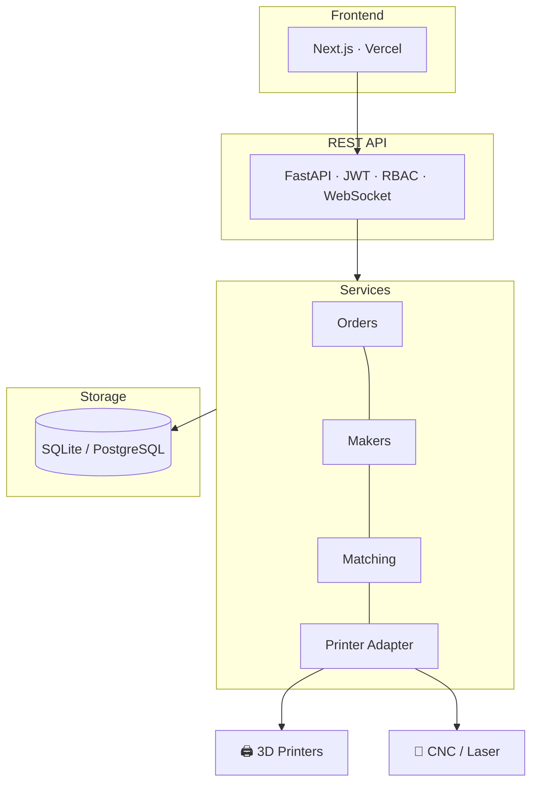

<p align="center">
  <picture>
    <source media="(prefers-color-scheme: light)" srcset="brand/logo-dark.svg">
    
  </picture>
</p>

<p align="center"><strong>The distributed manufacturing network. Turn any idea into a physical object.</strong></p>

<p align="center">
  <a href="https://github.com/brianzhibo-design/RealWorldClaw/actions/workflows/ci.yml"></a>
  <a href="https://github.com/brianzhibo-design/RealWorldClaw/actions/workflows/codeql.yml"></a>
  <a href="LICENSE"></a>
  <a href="https://github.com/brianzhibo-design/RealWorldClaw/releases"></a>
  <a href="https://github.com/brianzhibo-design/RealWorldClaw/stargazers"></a>
  <a href="https://python.org"></a>
  <a href="https://nextjs.org"></a>
  <a href="https://fastapi.tiangolo.com"></a>
  <a href="docker-compose.yml"></a>
  <a href="https://github.com/brianzhibo-design/RealWorldClaw/graphs/contributors"></a>
</p>

<p align="center">
  <a href="https://realworldclaw.com">Website</a> ·
  <a href="PROJECT.md">Vision</a> ·
  <a href="docs/ROADMAP.md">Roadmap</a> ·
  <a href="docs/">Docs</a> ·
  <a href="CONTRIBUTING.md">Contributing</a>
</p>

---

RealWorldClaw is building the **cloud computing layer for manufacturing**.

- **Designers** submit files and get parts produced.
- **Makers** connect idle machines and earn from fulfilled orders.
- **Agents & apps** call the API to move from digital designs to physical output.

### Why Now?

| Before | Now |
|---|---|
| Design was expensive and slow | AI drastically lowers design cost |
| Manufacturing favored large batches | Modern fabrication enables economical small runs |
| Global maker capacity stayed fragmented | RealWorldClaw networks that capacity on demand |

---

## 🚀 Quick Start

### Run Locally

```bash
git clone https://github.com/brianzhibo-design/RealWorldClaw.git
cd RealWorldClaw

# API (FastAPI)
cd platform
pip install -r requirements.txt
python -m uvicorn api.main:app --reload

# Web (Next.js)
cd ../frontend
npm install
npm run dev
```

Requirements: **Python 3.11+**, **Node 18+**

### Docker

```bash
docker compose up
```

### API Examples

```bash
API=https://realworldclaw-api.fly.dev/api/v1

# Health
curl https://realworldclaw-api.fly.dev/health

# Public spaces
curl $API/spaces

# API schema/docs
open https://realworldclaw-api.fly.dev/docs
```

For full API reference and workflows, see [docs/](docs/).

---

## 🔧 Features

- Manufacturing order system (submission, matching, fulfillment tracking)
- Maker network with capabilities, materials, and service coverage
- Matching engine (distance, material, reputation, and pricing signals)
- Universal printer adapter (Bambu Lab, OctoPrint, Moonraker, PrusaLink)
- FastAPI backend + Next.js frontend + automated CI quality gates

---

## 📐 Architecture


```mermaid
graph TB
    subgraph Frontend
        A[Next.js · Vercel]
    end
    subgraph API["REST API"]
        B[FastAPI · JWT · RBAC · WebSocket]
    end
    subgraph Services
        C[Orders] --- D[Makers] --- E[Matching] --- F[Printer Adapter]
    end
    subgraph Storage
        G[(SQLite / PostgreSQL)]
    end
    A --> B --> Services --> G
    F --> H[🖨️ 3D Printers]
    F --> I[🔧 CNC / Laser]
```

---

## 🗂️ Project Structure

```text
RealWorldClaw/
├── platform/           # Backend — FastAPI, 28+ API endpoints
│   ├── api/            #   REST API, auth, models, routes
│   ├── printer/        #   Universal printer adapter
│   └── tests/          #   Unit & integration tests
├── frontend/           # Web app — Next.js
├── hardware/           # 3D models & PCB designs
│   └── energy-core/    #   Energy Core (first product)
├── firmware/           # ESP32 firmware (PlatformIO)
├── docs/               # Documentation & specs
├── docs-site/          # VitePress documentation site
├── brand/              # Logo, OG images, brand assets
├── cli/                # CLI tools
├── sdk/                # Python SDK
├── scripts/            # Automation & social media
├── tools/              # Rendering & build tools
├── docker-compose.yml  # One-command dev setup
└── Makefile            # make dev / make test / make lint
```

---

## ⚡ Energy Core

Our first hardware product in this ecosystem: AI-native hardware designed for the RealWorldClaw network.

- Hardware assets: [hardware/energy-core/](hardware/energy-core/)
- System vision: [PROJECT.md](PROJECT.md)

---

## 🗺️ Roadmap

See [docs/ROADMAP.md](docs/ROADMAP.md) for active planning.

| Phase | Focus | Status |
|---|---|---|
| Phase 0 | Core API + platform foundation | ✅ Live |
| Phase 1 | Maker network + fulfillment workflows | 🟡 In Progress |
| Phase 2 | AI-assisted optimization + multi-process expansion | ⚪ Planned |

---

## 🤝 Contributing

Contributions are welcome from developers, makers, and designers.

- Start here: [CONTRIBUTING.md](CONTRIBUTING.md)
- Open ideas and bugs: [GitHub Issues](https://github.com/brianzhibo-design/RealWorldClaw/issues)
- Product discussions: [GitHub Discussions](https://github.com/brianzhibo-design/RealWorldClaw/discussions)

---

## 📄 License

[MIT](LICENSE)

---

<p align="center">
  <sub>Built with the belief that <b>anyone's idea deserves to become real</b>.</sub>
</p>

<p align="center">
  <a href="https://star-history.com/#brianzhibo-design/RealWorldClaw&Date">
    
  </a>
</p>