<p align="center">
  
</p>

<h1 align="center">RealWorldClaw</h1>

<p align="center">
  <strong>LEGO for Smart Hardware — Standard Modules + 3D Printing = Infinite AI Devices</strong>
</p>

<p align="center">
  <em>Give every AI a body. Give every 3D printer a purpose.</em>
</p>

<p align="center">
  <a href="https://github.com/brianzhibo-design/RealWorldClaw/actions/workflows/ci.yml"></a>
  <a href="https://github.com/brianzhibo-design/RealWorldClaw/releases"></a>
  <a href="LICENSE"></a>
  <a href="https://github.com/brianzhibo-design/RealWorldClaw/stargazers"></a>
  <a href="https://discord.gg/realworldclaw"></a>
</p>

<p align="center">
  <a href="README_CN.md">中文</a> | English
</p>

---

## What is RealWorldClaw?

RealWorldClaw is an **open-source modular hardware platform** that bridges AI agents with the physical world. It defines a standard component system — snap-together modules connected via an 8-pin magnetic bus — that anyone with a 3D printer can manufacture and assemble into smart devices.

Think of it as **npm for hardware**: a component registry, a maker network for distributed manufacturing, and a platform API that lets AI agents design, order, and control physical devices — all through a single CLI.

## Architecture

```mermaid
graph TB
    subgraph "CLI & Frontend"
        CLI["rwc CLI"] --> API
        Frontend["Web Dashboard"] --> API
        Frontend --> WS["WebSocket"]
    end

    subgraph "Platform API"
        API["FastAPI Server"] --> Components["Component Registry"]
        API --> Orders["Order Engine"]
        API --> Agents["Agent Protocol"]
        API --> Matching["Maker Matching"]
        WS --> Events["Realtime Events"]
    end

    subgraph "Printer Adapters"
        Orders --> Bambu["Bambu Lab"]
        Orders --> OctoPrint["OctoPrint"]
        Orders --> Moonraker["Moonraker/Klipper"]
    end

    subgraph "Hardware Layer"
        Bambu --> Printer["3D Printer"]
        OctoPrint --> Printer
        Moonraker --> Printer
        Printer --> Device["Assembled Device"]
    end

    subgraph "Module System (RWC Bus)"
        Device --- Core["🧠 Core"]
        Device --- Display["🖥️ Display"]
        Device --- Audio["🔊 Audio"]
        Device --- Power["🔋 Power"]
        Device --- Servo["⚙️ Servo"]
        Device --- Sensor["📡 Sensor"]
    end
```



## Quick Start

```bash
# 1. Clone
git clone https://github.com/brianzhibo-design/RealWorldClaw.git
cd RealWorldClaw

# 2. Install
cd platform && pip install -e . && cd ..

# 3. Run
rwc status
```

> **Prerequisites:** Python 3.11+, Node 18+ (for frontend)

## Features

| | Feature | Description |
|---|---|---|
| 🧩 | **Modular Components** | Snap-together hardware modules with 8-pin magnetic RWC Bus |
| 🖨️ | **Printer Adapters** | Native support for Bambu Lab, OctoPrint, and Moonraker |
| 🤖 | **Agent Protocol** | AI agents can design and order physical devices via API |
| 🌐 | **Maker Network** | Distributed manufacturing — match orders to nearby printers |
| ⚡ | **Realtime Events** | WebSocket-powered live updates on print jobs and orders |
| 🔐 | **Auth & Security** | JWT auth, rate limiting, audit logging, CORS middleware |
| 📦 | **Component Registry** | Versioned manifests with JSON Schema validation |
| 🎯 | **CLI Tools** | `rwc` command for status, discovery, and management |

## Module System

| Module | Type | Interface | Description |
|--------|------|-----------|-------------|
| 🧠 Core | `core` | ESP32-S3 | Main compute — WiFi, BLE, I²C/SPI hub |
| 🖥️ Display | `display` | SPI TFT | 1.69" 240×280 round-rect screen |
| 🔊 Audio | `audio` | I²S DAC | Speaker + microphone module |
| 🔋 Power | `power` | USB-C PD | Li-Po battery + charging circuit |
| ⚙️ Servo | `servo` | PWM | Pan/tilt servo for motion |
| 📡 Sensor | `sensor` | I²C | Temperature, humidity, PIR, ToF |

All modules connect via the **RWC Bus** — an 8-pin magnetic pogo connector carrying power (5V/3.3V), I²C, SPI, and GPIO.

## Screenshots & Demo

<!-- TODO: Add screenshots of the web dashboard and assembled devices -->

> 🎬 Demo video coming soon — [subscribe for updates](https://github.com/brianzhibo-design/RealWorldClaw/releases)

## Documentation

| Resource | Link |
|----------|------|
| 📖 Module Standard | [`docs/specs/rwc-module-standard-v1.md`](docs/specs/rwc-module-standard-v1.md) |
| 🏗️ Architecture | [`docs/architecture/`](docs/architecture/) |
| 🔌 API Reference | [`docs/api-reference.md`](docs/api-reference.md) |
| 🚀 Deployment Guide | [`docs/deployment-guide.md`](docs/deployment-guide.md) |
| 🛒 Purchasing Guide | [`docs/purchasing-guide.md`](docs/purchasing-guide.md) |
| 🗺️ Roadmap | [`ROADMAP.md`](ROADMAP.md) |
| 📁 Project Structure | [`STRUCTURE.md`](STRUCTURE.md) |

## Contributing

We welcome contributions of all kinds! See [`CONTRIBUTING.md`](CONTRIBUTING.md) for guidelines.

```bash
# Run tests
cd platform && pytest

# Run frontend
cd frontend && npm run dev
```

## Community

- 💬 [Discord](https://discord.gg/realworldclaw) — Chat with the team and other makers
- 🗣️ [GitHub Discussions](https://github.com/brianzhibo-design/RealWorldClaw/discussions) — Ideas, Q&A, show & tell
- 🐦 [Twitter / X](https://x.com/realworldclaw) — Updates and announcements
- 📧 [Email](mailto:hello@realworldclaw.com) — Business inquiries

## License

[MIT](LICENSE) © 2025-present RealWorldClaw Contributors

---

<p align="center">
  <strong>Built with</strong>
</p>

<p align="center">
  
  
  
  
  
  
  
</p>

<p align="center">
  <a href="https://star-history.com/#brianzhibo-design/RealWorldClaw&Date">
    
  </a>
</p>
