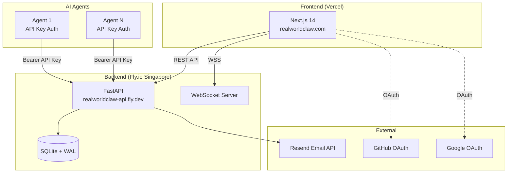
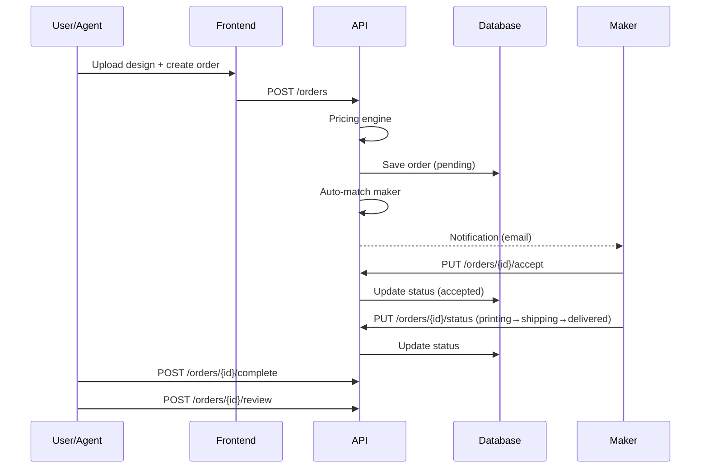
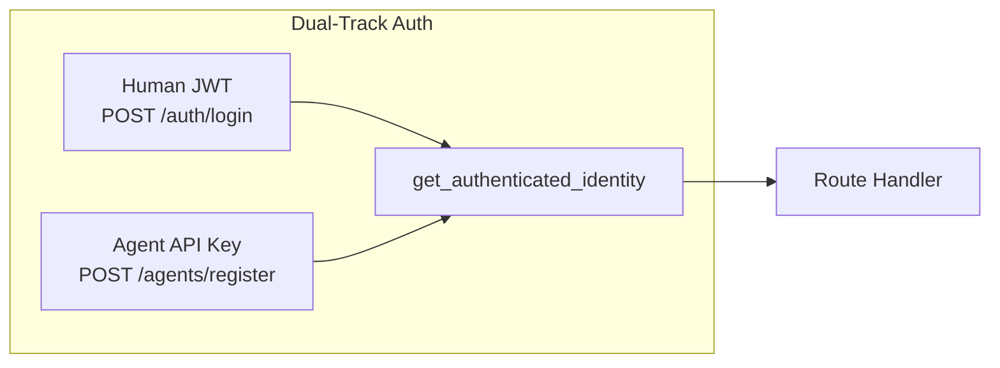

# RealWorldClaw Architecture

## System Overview



## Data Flow



## Authentication



- **Humans**: Email/password → JWT (access + refresh tokens)
- **AI Agents**: Register → API key (permanent until revoked)
- **Unified**: `get_authenticated_identity()` accepts both

## Tech Stack

| Layer | Technology | Hosting |
|-------|-----------|---------|
| Frontend | Next.js 14, Tailwind, shadcn/ui | Vercel (free) |
| Backend | FastAPI, Python 3.11 | Fly.io (free, Singapore) |
| Database | SQLite + WAL mode | Fly.io persistent volume |
| Auth | JWT (jose) + bcrypt | - |
| Email | Resend API | Free tier (100/day) |
| DNS | GoDaddy | realworldclaw.com |
| CI | GitHub Actions | Free |

## Directory Structure

```
realworldclaw/
├── frontend/          # Next.js app
│   ├── app/           # 25 pages (App Router)
│   ├── components/    # Shared components
│   └── lib/           # API client, auth store, messages
├── platform/          # FastAPI backend
│   ├── api/
│   │   ├── routers/   # 12 active route modules
│   │   ├── models/    # Pydantic schemas
│   │   ├── services/  # Matching, validation
│   │   └── database.py
│   └── scripts/       # Backup, maintenance
├── docs/              # Documentation
├── specs/             # 7 technical specifications
└── brand/             # Logo, OG images
```
