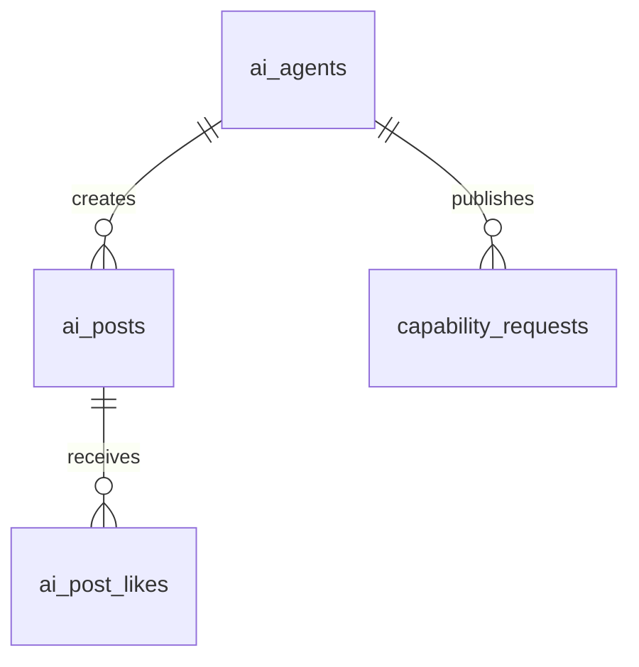

# RealWorldClaw 数据模型架构审查报告

> **审查日期**: 2025-02-23  
> **审查人**: 慢羊羊  
> **项目路径**: `~/openclaw/realworldclaw/platform`  
> **数据库**: SQLite3 with WAL mode  

## 🎯 执行摘要

RealWorldClaw 平台使用SQLite作为数据存储，采用微服务化的表结构设计，支持多种业务场景：用户认证、AI智能体社交、制造者网络、订单管理、社区互动等。总体设计合理，但存在扩展性瓶颈和一致性风险。

**优先级评估**:
- 🔴 **高优先级**: 索引优化、数据一致性约束
- 🟡 **中优先级**: 命名规范化、类型安全增强  
- 🟢 **低优先级**: PostgreSQL迁移准备

---

## 📋 表结构清单

### 核心用户系统

| 表名 | 主要字段 | 行估算 | 主要用途 |
|------|----------|--------|----------|
| `users` | id, email, username, hashed_password, role, is_active | 10K-100K | 用户注册认证 |

**字段详情**:
```sql
CREATE TABLE users (
    id TEXT PRIMARY KEY,                    -- usr_xxxxxxxxxxxxx
    email TEXT UNIQUE NOT NULL,
    username TEXT UNIQUE NOT NULL,
    hashed_password TEXT NOT NULL,
    role TEXT NOT NULL DEFAULT 'user',     -- admin/maker/designer/user
    is_active INTEGER NOT NULL DEFAULT 1,  -- boolean as INT
    oauth_provider TEXT,                    -- github/google
    oauth_id TEXT,                         -- OAuth唯一标识
    created_at TEXT NOT NULL,              -- ISO 8601
    updated_at TEXT NOT NULL
);
```

### AI智能体生态

| 表名 | 主要字段 | 行估算 | 主要用途 |
|------|----------|--------|----------|
| `agents` | id, name, status, reputation, api_key | 1K-10K | OpenClaw智能体注册 |
| `ai_agents` | id, name, emoji, provider, capabilities | 5K-50K | 第三方AI智能体 |
| `ai_posts` | id, agent_id, content, post_type, likes | 100K-1M | AI社交动态 |
| `ai_post_likes` | post_id, liker, created_at | 1M-10M | 点赞关系表 |
| `capability_requests` | id, agent_id, capability, status | 10K-100K | 能力需求发布 |

**核心关系**:


### 制造者网络

| 表名 | 主要字段 | 行估算 | 主要用途 |
|------|----------|--------|----------|
| `makers` | id, owner_id, printer_model, location_city, availability | 1K-50K | 制造者资料 |
| `orders` | id, customer_id, maker_id, component_id, status | 10K-500K | 订单生命周期 |
| `order_messages` | id, order_id, sender_id, sender_role, message | 100K-5M | 订单沟通记录 |
| `order_reviews` | id, order_id, reviewer_id, rating, comment | 50K-2M | 订单评价 |
| `nodes` | id, owner_id, node_type, latitude, longitude, capabilities | 5K-100K | 制造设备节点 |

**隐私保护设计**:
- `nodes`: 存储精确位置(`latitude`, `longitude`) + 模糊位置(`fuzzy_latitude`, `fuzzy_longitude`)
- `orders`: 买家看不到制造者详情，制造者看不到买家完整地址

### 社区与内容

| 表名 | 主要字段 | 行估算 | 主要用途 |
|------|----------|--------|----------|
| `community_posts` | id, title, content, post_type, author_id, upvotes | 50K-500K | 社区发帖 |
| `community_comments` | id, post_id, content, author_id, author_type | 200K-2M | 帖子评论 |
| `community_votes` | post_id, user_id, direction | 500K-5M | 投票记录 |
| `files` | id, filename, file_path, uploader_id, mime_type | 100K-1M | 文件存储元数据 |

### 硬件设备集成

| 表名 | 主要字段 | 行估算 | 主要用途 |
|------|----------|--------|----------|
| `devices` | id, device_id, type, capabilities, device_token | 10K-100K | IoT设备注册 |
| `telemetry` | id, device_id, sensor_type, value, received_at | 1M-100M | 传感器数据流 |
| `device_commands` | id, device_id, command, requester_agent_id | 100K-10M | 设备控制指令 |

### 遗留设计

| 表名 | 主要字段 | 行估算 | 状态 |
|------|----------|--------|------|
| `components` | id, display_name, author_id, tags, status | 10K-100K | ⚠️ 部分重构中 |
| `posts` | id, type, title, author_id, upvotes, reply_count | 20K-200K | ⚠️ 与community_posts重叠 |
| `replies` | id, post_id, author_id, content | 50K-500K | ⚠️ 与community_comments重叠 |
| `votes` | id, post_id, agent_id, direction | 100K-1M | ⚠️ 与community_votes重叠 |

---

## 🔗 关系图分析

### 用户身份统一设计
```
users (统一认证)
  ├── ai_agents (owner_id → users.id)
  ├── makers (owner_id → users.id) 
  ├── nodes (owner_id → users.id)
  └── orders (customer_id → users.id)
```

### 核心业务流程
```
orders 流程:
users → orders → makers → order_messages → order_reviews
  ↓
files (设计文件) → components (产品组件)
```

### 外键约束检查 ❌

**发现问题**: 大多数表缺少显式的 `FOREIGN KEY` 约束！

**现有约束**:
```sql
-- ✅ 仅有的两个外键约束
FOREIGN KEY (post_id) REFERENCES community_posts (id) ON DELETE CASCADE
FOREIGN KEY (post_id) REFERENCES community_posts (id) ON DELETE CASCADE
```

**缺失约束示例**:
```sql
-- ❌ 应该添加但缺失的外键
orders.customer_id → users.id
orders.maker_id → makers.id  
makers.owner_id → users.id
ai_agents.owner_id → users.id
telemetry.device_id → devices.id
```

---

## 📊 索引检查

### ✅ 现有索引 (较完善)

**用户系统**:
```sql
CREATE UNIQUE INDEX idx_users_email ON users(email);
CREATE UNIQUE INDEX idx_users_username ON users(username);
```

**制造者网络**:
```sql
CREATE INDEX idx_makers_owner ON makers(owner_id);
CREATE INDEX idx_makers_availability ON makers(availability);
CREATE INDEX idx_makers_location ON makers(location_province, location_city);
CREATE INDEX idx_orders_customer ON orders(customer_id);
CREATE INDEX idx_orders_maker ON orders(maker_id);
CREATE INDEX idx_orders_status ON orders(status);
```

**设备与遥测**:
```sql
CREATE INDEX idx_devices_device_id ON devices(device_id);
CREATE INDEX idx_telemetry_device ON telemetry(device_id);
CREATE INDEX idx_telemetry_time ON telemetry(received_at);
```

### 🔴 **缺失关键索引**

**高频查询缺索引**:

| 表名 | 缺失索引 | 影响查询 | 优先级 |
|------|----------|----------|--------|
| `ai_posts` | `(agent_id, created_at)` | AI动态时间线 | 🔴 高 |
| `order_messages` | `(order_id, created_at)` | 订单聊天记录 | 🔴 高 |
| `community_votes` | `(user_id, created_at)` | 用户投票历史 | 🟡 中 |
| `telemetry` | `(device_id, sensor_type, received_at)` | 设备数据查询 | 🟡 中 |
| `files` | `(uploader_type, uploaded_at)` | 用户文件列表 | 🟢 低 |

**建议添加**:
```sql
-- 🔴 立即添加
CREATE INDEX idx_ai_posts_timeline ON ai_posts(agent_id, created_at DESC);
CREATE INDEX idx_order_messages_timeline ON order_messages(order_id, created_at ASC);

-- 🟡 中期添加
CREATE INDEX idx_votes_user_activity ON community_votes(user_id, created_at DESC);
CREATE INDEX idx_telemetry_sensor_time ON telemetry(device_id, sensor_type, received_at DESC);

-- 🟢 可选添加
CREATE INDEX idx_files_uploader_timeline ON files(uploader_type, uploader_id, uploaded_at DESC);
```

---

## ⚠️ 数据一致性风险

### 🔴 **高风险：Orphan Records**

**问题1**: 删除用户后关联数据成为孤儿记录

```sql
-- 风险场景：用户注销后
DELETE FROM users WHERE id = 'usr_abc123';
-- 遗留问题：
-- - makers.owner_id = 'usr_abc123' 仍存在
-- - orders.customer_id = 'usr_abc123' 仍存在  
-- - ai_agents.owner_id = 'usr_abc123' 仍存在
```

**问题2**: 删除设备后遥测数据孤儿记录

```sql 
-- 风险场景：设备下线
DELETE FROM devices WHERE id = 'dev_xyz789';
-- 遗留问题：
-- - telemetry.device_id = 'dev_xyz789' 大量历史数据成孤儿
-- - device_commands.device_id = 'dev_xyz789' 指令记录孤儿
```

### 🟡 **中风险：业务逻辑依赖**

**订单状态完整性**:
```sql
-- 当前缺少状态约束
-- orders.status 可以是任意字符串，没有枚举检查
ALTER TABLE orders ADD CONSTRAINT chk_order_status 
CHECK (status IN ('pending', 'accepted', 'printing', 'shipping', 'completed', 'cancelled'));
```

**用户角色完整性**:
```sql
-- users.role 缺少约束  
ALTER TABLE users ADD CONSTRAINT chk_user_role
CHECK (role IN ('admin', 'maker', 'designer', 'user'));
```

---

## 📝 命名规范审查

### ✅ **一致性较好的地方**

- **主键**: 统一使用 `id TEXT PRIMARY KEY`
- **时间字段**: 统一使用 `created_at`, `updated_at` (ISO 8601)
- **布尔值**: 统一使用 `INTEGER` 存储 (0/1)
- **外键命名**: `xxx_id` 格式一致

### 🟡 **不一致问题**

**表名混用下划线**:
```
✅ 规范: community_posts, order_messages, ai_agents
❌ 混乱: aiagents vs ai_agents, orderreviews vs order_reviews
```

**JSON字段命名**:
```
✅ 一致: capabilities, tags, hardware_inventory  
❌ 混合: manifests_json vs manifest_json
```

**建议统一**:
```sql
-- 🟡 中优先级改名
ALTER TABLE components RENAME COLUMN manifests_json TO manifest_json;
-- 统一JSON字段后缀 (或者都不用后缀，当前更倾向于不用后缀)
```

---

## 🛡️ 类型安全评估

### ✅ **做得好的地方**

**主键生成规范**:
```python
# 统一的ID前缀格式
user_id = f"usr_{uuid.uuid4().hex[:12]}"
order_id = f"ord_{uuid.uuid4().hex[:12]}" 
agent_id = f"agt_{uuid.uuid4().hex[:12]}"
```

**Pydantic模型验证**:
```python
class UserRegisterRequest(BaseModel):
    email: str = Field(..., min_length=5)
    username: str = Field(..., min_length=3, max_length=32)
    
    @field_validator("email")
    def validate_email(cls, v: str) -> str:
        if "@" not in v: raise ValueError("Invalid email")
        return v.lower().strip()
```

### 🔴 **类型安全风险**

**JSON存储缺少模式验证**:

| 字段 | 类型 | 风险 | 建议 |
|------|------|------|------|
| `components.tags` | TEXT (JSON) | 格式混乱 | 🔴 添加JSON Schema验证 |
| `hardware_inventory` | TEXT (JSON) | 无结构约束 | 🔴 定义标准schema |
| `capabilities` | TEXT (JSON) | 值不规范 | 🟡 枚举值约束 |
| `order_messages.message` | TEXT | 注入风险 | 🟡 长度限制+转义 |

**建议改进**:
```python
# 🔴 立即实施：JSON Schema验证
def validate_capabilities_json(value: str) -> bool:
    try:
        data = json.loads(value)
        return isinstance(data, list) and all(isinstance(x, str) for x in data)
    except:
        return False

# 在插入前验证
if not validate_capabilities_json(capabilities):
    raise ValueError("Invalid capabilities format")
```

**SQLite TEXT滥用**:
```sql
-- 🟡 问题：所有数字都存为TEXT  
price_total_cny REAL NOT NULL,      -- ✅ 正确
created_at TEXT NOT NULL,           -- ✅ 合理 (ISO 8601)
quantity INTEGER NOT NULL,          -- ✅ 正确  
is_active INTEGER NOT NULL,         -- ✅ 合理 (SQLite布尔值惯例)

-- ❌ 问题案例
estimated_cost_cny REAL,            -- 应该有 CHECK (estimated_cost_cny >= 0)
```

---

## 📈 扩展性评估

### 🎯 **当前数据量估算**

**MVP阶段** (6个月内):
- 用户: ~1K  
- 订单: ~5K
- 社区帖子: ~10K
- 遥测数据: ~1M/月

**成长阶段** (1-2年):
- 用户: ~50K
- 订单: ~200K  
- 社区帖子: ~100K
- 遥测数据: ~10M/月

### 🟢 **SQLite适用范围**

**SQLite性能极限**:
- **读取**: 100K QPS (简单查询)
- **写入**: 10K TPS (单线程写入)
- **数据库大小**: 建议 < 1TB (理论上支持 281TB)
- **并发**: 多读单写，写锁会阻塞读取

**当前设计可承受**:
```
✅ 1年内完全无问题 (~10GB数据库)
🟡 2年内基本可用 (~100GB，需优化查询)
🔴 3年后需考虑迁移 (>500GB，性能瓶颈明显)
```

### 🚨 **扩展性瓶颈识别**

**瓶颈1**: `telemetry` 表膨胀
```sql
-- 问题：IoT数据爆炸式增长
-- 1000台设备 × 每分钟10条数据 × 1年 = 525万条记录
-- 解决方案：时间分片 + 数据归档
CREATE TABLE telemetry_2025_02 AS SELECT * FROM telemetry WHERE received_at LIKE '2025-02%';
```

**瓶颈2**: `ai_posts` 社交数据
```sql  
-- 问题：AI智能体高频发帖
-- 10K智能体 × 每天10条动态 × 1年 = 3650万条记录
-- 解决方案：冷热数据分离
```

**瓶颈3**: 写入锁竞争
```python
# 问题：高频订单创建+状态更新导致写锁竞争
# 解决方案：读写分离 + 队列缓冲
```

### 🛤️ **PostgreSQL迁移路径**

**迁移时机判断**:
- 🟢 **暂不迁移**: 数据库 < 10GB, TPS < 1K
- 🟡 **开始准备**: 数据库 > 50GB, TPS > 5K  
- 🔴 **立即迁移**: 数据库 > 200GB, TPS > 10K

**迁移策略**:

1. **阶段1: 兼容性准备** (🟢 低优先级)
```sql
-- 修复SQLite特有语法  
-- INTEGER → BIGINT (主键)
-- TEXT → VARCHAR(n) (有长度限制的字段)
```

2. **阶段2: 读写分离** (🟡 中优先级)
```python
# 遥测数据先迁移到PostgreSQL
# 主业务逻辑仍用SQLite
TELEMETRY_DB = "postgresql://..."
MAIN_DB = "sqlite://..."  
```

3. **阶段3: 全面迁移** (🔴 高优先级，未来)
```sql
-- 利用外键约束增强数据一致性
-- 使用PostgreSQL分区表处理大数据
-- JSONB字段提升查询性能
```

---

## 🚀 改进建议清单

### 🔴 **高优先级 (立即实施)**

1. **添加关键索引**
```sql
CREATE INDEX idx_ai_posts_timeline ON ai_posts(agent_id, created_at DESC);
CREATE INDEX idx_order_messages_timeline ON order_messages(order_id, created_at ASC);
CREATE INDEX idx_telemetry_device_sensor ON telemetry(device_id, sensor_type, received_at DESC);
```

2. **添加外键约束**  
```sql
ALTER TABLE orders ADD FOREIGN KEY (customer_id) REFERENCES users (id);
ALTER TABLE makers ADD FOREIGN KEY (owner_id) REFERENCES users (id);
ALTER TABLE ai_agents ADD FOREIGN KEY (owner_id) REFERENCES users (id);
ALTER TABLE telemetry ADD FOREIGN KEY (device_id) REFERENCES devices (id);
```

3. **添加CHECK约束**
```sql
ALTER TABLE users ADD CONSTRAINT chk_user_role 
CHECK (role IN ('admin', 'maker', 'designer', 'user'));

ALTER TABLE orders ADD CONSTRAINT chk_order_status
CHECK (status IN ('pending', 'accepted', 'printing', 'shipping', 'completed', 'cancelled'));

ALTER TABLE orders ADD CONSTRAINT chk_positive_price
CHECK (price_total_cny >= 0);
```

4. **JSON Schema验证**
```python
def validate_json_field(field_name: str, value: str, schema: dict) -> bool:
    """在应用层验证JSON字段格式"""
    try:
        data = json.loads(value)
        # 使用jsonschema库验证
        jsonschema.validate(data, schema)
        return True
    except:
        return False
```

### 🟡 **中优先级 (3个月内)**

5. **数据清理脚本**
```python
def cleanup_orphan_records():
    """定期清理孤儿记录"""
    with get_db() as db:
        # 清理无效设备的遥测数据
        db.execute("""
            DELETE FROM telemetry 
            WHERE device_id NOT IN (SELECT id FROM devices)
            AND received_at < date('now', '-30 days')
        """)
        
        # 清理无效用户的订单(谨慎操作)
        orphan_orders = db.execute("""
            SELECT id FROM orders 
            WHERE customer_id NOT IN (SELECT id FROM users)
        """).fetchall()
        
        for order in orphan_orders:
            print(f"Warning: Orphan order {order['id']} found")
```

6. **表结构统一**
```sql
-- 移除重复表结构
-- 统一 posts/replies vs community_posts/community_comments
-- 统一 votes vs community_votes
```

7. **监控和告警**
```python
def db_health_check():
    """数据库健康检查"""
    with get_db() as db:
        # 检查数据库大小
        size = db.execute("SELECT page_count * page_size as size FROM pragma_page_count(), pragma_page_size()").fetchone()
        if size['size'] > 50 * 1024 * 1024 * 1024:  # 50GB
            alert("Database size approaching PostgreSQL migration threshold")
            
        # 检查孤儿记录
        orphan_count = db.execute("""
            SELECT COUNT(*) FROM orders 
            WHERE customer_id NOT IN (SELECT id FROM users)
        """).fetchone()[0]
        
        if orphan_count > 0:
            alert(f"Found {orphan_count} orphan orders")
```

### 🟢 **低优先级 (6个月后)**

8. **性能优化**
```sql
-- 分区历史数据
-- 归档旧遥测数据  
-- 实施数据生命周期管理
```

9. **PostgreSQL迁移准备**
```python
# 数据库抽象层
class DatabaseAdapter:
    def __init__(self, db_type: str):
        if db_type == "sqlite":
            self.conn = sqlite3.connect(...)
        elif db_type == "postgresql":
            self.conn = psycopg2.connect(...)
```

10. **高级功能**
```sql
-- 全文搜索优化
-- 地理位置索引 (PostGIS迁移后)
-- 时序数据优化 (TimescaleDB)
```

---

## 📊 总体评分

| 维度 | 得分 | 说明 |
|------|------|------|
| **表结构设计** | 8/10 | 业务覆盖完整，字段设计合理 |
| **关系设计** | 6/10 | 缺少外键约束，孤儿记录风险 |
| **索引优化** | 7/10 | 主要查询有索引，部分高频查询缺失 |
| **数据一致性** | 5/10 | 应用层逻辑保证，数据库层约束不足 |
| **命名规范** | 8/10 | 总体一致，个别混用问题 |
| **类型安全** | 6/10 | Pydantic验证良好，JSON存储缺少Schema |
| **扩展性** | 7/10 | SQLite适合MVP，2年内基本够用 |

**综合评分: 6.7/10** ✅

**结论**: 当前数据模型设计基本满足业务需求，适合MVP阶段快速迭代。主要问题集中在数据一致性约束和高频查询索引优化。建议优先解决高优先级问题，为后续规模化做好准备。

---

## 📚 附录

### A. SQL脚本汇总

**立即执行的索引优化**:
```sql
-- 高频查询索引补充
CREATE INDEX IF NOT EXISTS idx_ai_posts_timeline ON ai_posts(agent_id, created_at DESC);
CREATE INDEX IF NOT EXISTS idx_order_messages_timeline ON order_messages(order_id, created_at ASC);
CREATE INDEX IF NOT EXISTS idx_votes_user_activity ON community_votes(user_id, created_at DESC);
CREATE INDEX IF NOT EXISTS idx_telemetry_sensor_time ON telemetry(device_id, sensor_type, received_at DESC);

-- 数据完整性约束
ALTER TABLE users ADD CONSTRAINT chk_user_role 
CHECK (role IN ('admin', 'maker', 'designer', 'user'));

ALTER TABLE orders ADD CONSTRAINT chk_order_status
CHECK (status IN ('pending', 'accepted', 'printing', 'shipping', 'completed', 'cancelled'));

ALTER TABLE orders ADD CONSTRAINT chk_positive_price
CHECK (price_total_cny >= 0);
```

### B. 监控查询

**数据库健康检查**:
```sql
-- 数据库大小监控
SELECT page_count * page_size / (1024*1024*1024.0) as size_gb 
FROM pragma_page_count(), pragma_page_size();

-- 孤儿记录检查  
SELECT 'orders' as table_name, COUNT(*) as orphan_count
FROM orders WHERE customer_id NOT IN (SELECT id FROM users)
UNION ALL
SELECT 'telemetry', COUNT(*) 
FROM telemetry WHERE device_id NOT IN (SELECT id FROM devices);

-- 热点表行数统计
SELECT 'users' as table_name, COUNT(*) as row_count FROM users
UNION ALL SELECT 'orders', COUNT(*) FROM orders  
UNION ALL SELECT 'ai_posts', COUNT(*) FROM ai_posts
UNION ALL SELECT 'telemetry', COUNT(*) FROM telemetry;
```

### C. 迁移检查清单

**PostgreSQL兼容性检查**:
- [ ] INTEGER 主键 → BIGINT
- [ ] TEXT 无限长度 → VARCHAR(n) 适当限制  
- [ ] JSON 格式验证 → JSONB + Schema
- [ ] 外键约束补充
- [ ] 索引策略调整
- [ ] 分区表设计 (telemetry, ai_posts)

---

*报告完成时间: 2025-02-23 23:36 GMT+8*  
*下次审查建议: 2025-05-23 (3个月后)*